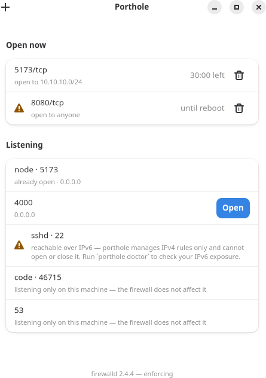

# porthole

Open a port to your local network, temporarily and on purpose — and let it close
itself.

On a laptop, exposing a dev server to the local network is an all-or-nothing
choice that every existing tool handles badly. Fedora Workstation opens ports
1025-65535 by default, so every high port is reachable by anyone on the hotel
wifi. Closing that range is the right thing to do, but from then on testing a
site from your phone means remembering `firewall-cmd` syntax, remembering to
close it again, and knowing which firewall the machine you are on actually uses.

porthole does one thing: it opens a single port towards the network you are on
right now, for a bounded amount of time, and closes it again.

```console
$ porthole open 5173 --for 30m
Opened 5173/tcp towards 10.10.10.0/24 · closes 30m 0s

$ porthole list
PORT      TOWARDS        BACKEND    CLOSES IN
5173/tcp  10.10.10.0/24  firewalld  29m 41s

$ porthole close 5173
Closed 5173/tcp towards 10.10.10.0/24
```

Opening and closing no longer need root: a privileged helper does the work — a
system D-Bus service authorised by polkit, rather than the CLI holding
privilege itself. Installing it does need root, **once**: a helper binary, a
polkit policy, a D-Bus configuration and a systemd unit. See
[docs/installing.md](docs/installing.md) for where each one goes; until a
distribution packages porthole, you place them by hand.

`porthole list` and `porthole status` need none of that installed at all —
they never touch the bus. `--dry-run` changes nothing, and for `open` and
`close` it needs no privileges either. Two dry runs are not like that, and
they differ from each other:

- `open --dry-run` makes the one read-only call every `open` makes, asking the
  helper whether Docker has already published that port. That call is
  best-effort — no helper, no answer, no complaint, and the dry run goes
  ahead.
- **`forward --dry-run` needs root, and fails without it.** It does not go
  through the helper at all: it builds the engine locally, and the engine
  reads Docker's own `DOCKER` chain to find out which container publishes the
  port. That read needs root, so an ordinary user gets exit 10
  (`docker_unreadable`) rather than a printed command. That is the deliberate
  direction — a dry run that could not check says so instead of pretending it
  could — but it does mean this is the one `--dry-run` that is not available
  to everyone.

Once the helper is installed, opening towards
your own subnet asks polkit to authenticate the first time and not again that
session; opening towards everyone (`--to any`) asks every time, because it is
the more dangerous request; `porthole forward` asks every time too, whatever
its scope, because it makes a port answer to something that was not on the
network at all; closing never asks, because closing only ever reduces what is
exposed.

## What it is not

porthole is not a firewall manager. It does not do zones, services or
permanent rules. If you need those, use `firewall-config`, `ufw` or `nft`
directly.

It does write NAT, in exactly one shape. A `forward-port` rich rule is a DNAT
— this repository's own test for it is called
`a_redirect_rich_rule_renders_to_a_dnat_and_no_filter_rule` — so "porthole
does no NAT" would be a distinction the code does not make. What is true is
narrower: it does one kind of redirect, and only one. `porthole forward` puts a port in
front of a Docker container that is published on this machine's loopback
address and nowhere else — see [Forwarding to a
container](#forwarding-to-a-container). It is a runtime rule with a timer like
every other, it exists only while it is open, and it is not a port-forwarding
feature you can point anywhere you like.

**It never writes a permanent rule.** A reboot closes everything porthole
opened. That is the whole design, not a limitation.

**It does not manage IPv6.** Version 1 opens and closes IPv4 rules and
nothing else. On a network with IPv6 active, a port porthole reports as
closed can still be reachable over IPv6, and opening one changes nothing for
IPv6 traffic. porthole's own account of what it did says nothing either way.
`porthole listen` marks the services it can see bound to a real IPv6 address
and `porthole doctor` repeats the caveat, but neither is a rule porthole can
act on.

## Design

- **The default scope is the subnet you are on**, not "anyone who can reach this
  interface". Opening towards everyone is possible, but you have to ask for it.
- **The default duration is one hour, and the maximum is eight.** Past that
  there is only `--until-reboot`, which still dies by itself. A low ceiling is
  what makes "temporary" true.
- **Automatic close runs on a systemd transient timer**, so you can see it with
  `systemctl list-timers` and it does not depend on any process staying alive.

## The GUI

Everything above is also a window. `porthole-gui` shows what is open now with
a live countdown, shows what is listening on this machine so you can open a
port without typing a number, opens one in two clicks, offers a **Forward**
button on the rows Docker has published only on loopback, and saves a device
to open towards. It talks to the
same privileged helper over the same D-Bus interface the CLI uses, so it
inherits the 8-hour ceiling and the polkit prompts without restating either —
nothing about *what* porthole will do changes depending on which one you run.
A window has no exit code to inherit; a failed request shows the helper's own
message in the GUI instead, the same wording the CLI would have printed.



*Rendered by the app itself, under Xvfb, from invented example data — not a
real machine's, which would either show nothing on a machine with no ports
open or leak whatever is genuinely listening on the machine that took it.*

GTK4/libadwaita is not required to build or run the CLI or the helper — the
GUI lives in its own crate, `porthole-gui`, built and tested in a container
(`tests/container/Containerfile.gui`) because this project's own development
host has no GTK4 installed. See [docs/installing.md](docs/installing.md) for
the desktop file, icon and AppStream metadata that make it appear in an app
grid or a software centre once installed.

## Install

Distribution packages are not published yet. To build from source you need Rust
1.87 or newer — the privileged helper depends on `zbus`, and every `zbus 5.19`
component declares `rust-version = "1.87"`. **Debian 13 ships rustc 1.85**, so
packaging porthole for it means bringing a newer toolchain along, not just
running `cargo build` with the system one.

```bash
git clone https://github.com/jmbriccola/porthole
cd porthole
cargo build --release
sudo install -m 0755 target/release/porthole /usr/local/bin/porthole
```

That gives you `porthole list`, `porthole status`, `porthole doctor`,
`porthole devices`, and `--dry-run` for `open` and `close`. `open`, `forward`
and `close` need the privileged helper installed; so does the Docker half of
`porthole listen`, `porthole open` and `porthole doctor`, since reading
Docker's own rules needs root — and so, for the same reason, does `forward
--dry-run`, which does that read itself rather than through the helper. The
same `cargo build --release` also produces `porthole-agent`, which is what
turns a close nobody asked for into a desktop notification.

For all of it at once — the three binaries, the polkit policy, the D-Bus
files, the systemd units, the icons, the man pages and the shell completions
— the `Makefile` installs the layout every package of this project uses:

```bash
make                                  # cargo build --release, plus the
                                      # man pages and completions
make build-gui                        # needs GTK4/libadwaita headers
sudo make install PREFIX=/usr
```

`DESTDIR` is honoured by every rule, so a packager stages into one and never
touches the live system: `make install DESTDIR=/tmp/stage PREFIX=/usr`.
`make check-install` does exactly that into a throwaway directory and prints
what landed. `WITH_GUI=0` leaves out the GUI binary, its desktop entry and
its AppStream metainfo, for a machine with no desktop. `PREFIX` defaults to
`/usr` rather than `/usr/local` because the D-Bus activation file names
`/usr/libexec/porthole-helper` literally; see
[docs/installing.md](docs/installing.md), which also covers installing each
piece by hand.

### Removing it

Removing the package closes every port porthole still has open — every
redirect `porthole forward` made included — first. That is not a courtesy:
uninstalling is the one action that ends every other way a porthole rule
could close. The timer that would have closed it re-executes
`/usr/bin/porthole`; `close`, the network-change monitor and reconciliation
all go through the helper. Take those away and the rule stays in the firewall,
with the record of it on a tmpfs and nothing left that can act on it.

So each of the three packages runs `porthole close --all` on the way out, and
only on the way out: `%preun` when `$1` is 0 (RPM), `prerm remove` (Debian),
`pre_remove` (Arch). An **upgrade** closes nothing — losing the access you
arranged would be a bad way to learn a new version had shipped.

It is best effort, and it says so when it fails. A removal must not fail
because a port could not be closed, so if the helper cannot be reached — no
system bus, polkit not running, a helper left broken by an earlier failed
upgrade — the removal continues and prints:

```
porthole: WARNING: `porthole close --all` failed (exit 1).
porthole: Any port porthole had open is still open, and removing this
porthole: package leaves nothing behind that would close it. Check with
porthole: `firewall-cmd --list-rich-rules`, `ufw status numbered` or
porthole: `nft list ruleset` and remove what is left by hand.
```

That warning is the residual gap, and it is a real one. On firewalld and
nftables the rule porthole added is a runtime rule, so a reboot is the last
thing left that will close it. On ufw not even that: `ufw allow` writes into
`/etc/ufw/user.rules` and `ufw.service` reloads that file at every boot, and
the reconciliation that would otherwise sweep the rule runs inside a
`porthole` command there will never be another of. If you would rather not
depend on the removal reaching the helper, run `porthole close --all`
yourself first.

A `make install` installation has no scriptlets at all, and `make uninstall`
closes nothing — close first, by hand.

## Usage

```
porthole open <PORT> [--proto tcp|udp] [--for 30m | --until-reboot]
                     [--to subnet|any|<CIDR>|<IP>|<device name>]
porthole forward <PORT> [--as <PORT>] [--for 30m]
                        [--to subnet|any|<CIDR>|<IP>|<device name>]
porthole close <PORT> | --id <ID> | --all
porthole list
porthole status
porthole doctor
porthole listen
porthole devices list | add | rm <name>
```

`--to <name>` opens towards a saved device — see [Saved
devices](#saved-devices) below. `porthole listen` lists what is listening on
this machine, so you can pick a port instead of typing one.

Global flags:

- `--json` — machine-readable output. Every command that reports something
  honours it, and so does every failure. `devices add` is interactive, so its
  prompts go to stderr and stdout carries only the device it saved. See
  [docs/json-schema.md](docs/json-schema.md).
- `--dry-run` — print the commands porthole would run, and change nothing.
  Needs no privileges for `open` and `close`. `forward --dry-run` is the
  exception: it reads Docker's own rules itself, which needs root, and exits
  10 without it.

Defaults: `--proto tcp`, `--for 1h`, `--to subnet`.

## Saved devices

Opening towards one machine rather than the whole subnet means knowing its
address, and under DHCP that address changes. A saved device records a **MAC
address** instead, and `--to <name>` looks it up in the kernel's neighbour
table at the moment the port is opened — never earlier.

```console
$ porthole devices add
Seen on this network:
  1) bc:24:11:5e:1c:6e  10.10.10.245  (wlo1)  phone.example
  2) 50:e6:36:1a:9f:04  10.10.10.1  (wlo1)  _gateway
  3) de:ad:be:ef:00:01  10.10.10.7  (enp3s0)
The name after an address is what this machine's resolver answered for it. The MAC is what gets saved.
Pick a number: 1
Name this device: phone
Saved `phone` as bc:24:11:5e:1c:6e.

$ porthole devices list
phone    bc:24:11:5e:1c:6e  resolves to 10.10.10.245
printer  printer.local      not on this network right now

$ porthole open 5173 --to phone --for 30m
Opened 5173/tcp towards 10.10.10.245/32 · closes 30m 0s
```

`devices add` is an interactive prompt and offers the kernel's neighbour
table, minus the entries that carry no mapping worth acting on (`FAILED` and
`INCOMPLETE`, below) and minus every entry on a virtual interface. So a device
that has not spoken to this machine recently is not in the list, and neither
is one the kernel probed without getting an answer: make it talk to this
machine — load something from it, or ping it — and run the command again. It
saves a MAC and nothing else.

Docker containers, libvirt guests, podman pods and VPN peers all sit in the
kernel's neighbour table, on the interfaces that carry them. None of them is
on the network porthole opens a port towards, and the picker excludes exactly
the interfaces subnet detection already excludes (`docker*`, `br-*`,
`virbr*`, `veth*`, `podman*`, `tun*`, `tap*`, `wg*`, `tailscale*`, `zt*`,
`cni*`, `vboxnet*`, `lo`). A traditional `br0` bridging this machine's own
NIC is not one of them and is still offered. The same exclusion applies at
resolution time, so a MAC that is only in the table on one of those
interfaces reports as not on this network rather than resolving to an address
outside every subnet this machine holds. A device
named by hostname (`host = "printer.local"`, resolved through `getent`) is
added by editing `~/.config/porthole/devices.toml` by hand.

The name on a row is there so a person can tell two MAC addresses apart —
picking the wrong one opens a port towards the wrong machine. porthole asks
`getent hosts` for each address, which is the host's own name service: on a
typical machine that merges `/etc/hosts`, locally synthesised names, mDNS and
DNS, and it does not report which of them answered. So the name is shown as
the answer to that question and nothing is claimed about where it came from
— it is a hint, not an identity. **The MAC is the identity.** It is what the
picker saves, what `devices.toml` records and what `--to` matches; no name
seen here is stored or matched.

An address the resolver answers nothing for gets no name. Nothing stands in
for one — no "unknown device", no vendor guessed from the MAC prefix. Each
lookup is abandoned after **1 second** and the whole pass after **2**, since
a resolver that does not answer is ordinary on a home network and the picker
has to appear either way; addresses left over when the budget runs out are
shown without a name, exactly as an unanswered one is.

The GUI writes the same file, through **Saved Devices** in its menu or the
button beside the open dialog's target list. It offers the same picker and
adds a field for typing a MAC by hand, for a device that is switched off and
so cannot be picked. Such a device is saved without being found: the dialog
says at that moment that it did not resolve, and `open --to <name>` fails
with exit code 6 until it does.

That file is the whole address book, and it lives client-side. **The
privileged helper never reads it**: `--to <name>` is resolved in the CLI, and
what crosses D-Bus is an address. The rule that comes back records that
address as a `/32`, not the name — `porthole list` shows `10.10.10.245/32`,
and nothing porthole stores remembers that you asked for `phone`.

A few narrow edges worth knowing before you hit them:

- A device name that `--to` would read as a scope is refused when you save
  it, and refused again when the book is read back: `subnet`, `any`, an IP
  address or a CIDR, and any name containing `/` or `:`. Each of those would
  be taken as a scope rather than looked up, leaving the device saved and
  unreachable.
- A device that does not resolve right now is not an error in `devices list`,
  which says so per row. It is one for `open`, which fails with `device
  unreachable` and exit code 6 rather than opening towards a guess.
- `resolves to <address>` reports what the neighbour table holds, not a
  reachability test — porthole sends nothing to check. Entries the kernel
  marks `FAILED` or `INCOMPLETE` are rejected, since neither carries a mapping
  worth acting on. A `STALE` entry is accepted, because that is the ordinary
  state of an idle device — so a device that has just left can still be opened
  towards, until the kernel drops or rewrites its entry. **And the address it
  left behind may no longer be its own.** DHCP hands an address out again once
  the lease is gone, so `--to phone` can open a port towards whatever took
  that address next — a visitor's laptop on the same network. porthole cannot
  tell the two apart, and the rule stands for its whole duration either way.
  Keep the durations short, and prefer `porthole close` to waiting one out.

## Docker

Docker publishes ports by writing its own iptables rules, and those are
evaluated before firewalld, ufw or nftables ever see the packet. So a
container published on `0.0.0.0` is already reachable and `porthole close`
will not close it, and a container published on `127.0.0.1` is not made
reachable by `porthole open`, because the firewall was never what was stopping
it. **porthole never changes a Docker rule** — not to open one, not to close
one, not to move one.

Three commands say what Docker has done:

- `porthole listen` marks each published row `docker: published on
  <address>`, or `published on every interface`.
- `porthole open <port>` prints a note when Docker has published that exact
  port and protocol. It still opens the rule.
- `porthole doctor`'s `Docker` check names the published ports it could read.

And one command acts on it — `porthole forward`, below, which puts a port of
its own in front of a loopback-published container. That is a rule in *your*
firewall pointing at the container; Docker's own rules are read and never
touched.

All of them read the `DOCKER` chain of iptables' `nat` table directly. porthole
never runs `docker` and never looks at `docker` group membership, so it
behaves the same whether or not you can query Docker at all. That read needs
root, so it goes through the privileged helper. **With the helper not
installed or not answering, `listen` and `doctor` say they could not check**
rather than reporting that Docker touches nothing. `open` does not: it prints
its note when it has one and says nothing otherwise, so silence there means
either that no container holds that port or that Docker could not be asked.
`listen` is what tells those apart. `doctor` has one narrower
condition of its own — it looks for the interface `docker0` first, and reports
`not present` without asking the helper when there is none, so a daemon
configured with no default bridge reads as absent there.

Publish container ports on `127.0.0.1` in your compose files if you do not
want them reachable from the network. porthole cannot do that for you.

## Forwarding to a container

A container published on `127.0.0.1` is reachable from this machine and
nowhere else, and no firewall rule changes that: Docker's own DNAT rule only
matches traffic already addressed to `127.0.0.1`, which nothing on the network
can send. Opening the port does nothing. The usual answer is to republish the
container on `0.0.0.0` and then remember to put it back.

`porthole forward` is the other answer: a redirect that sends traffic arriving
on this machine's own network address to the container, for a bounded time,
and then removes itself.

```console
$ porthole listen
Listening on this machine

Loopback only — opening the firewall for these changes nothing:
  3000/tcp  docker-proxy  127.0.0.1:3000  pid 4711  docker: published on 127.0.0.1

$ porthole forward 3000 --for 30m
Forwarded 3000/tcp towards 10.10.10.0/24 · closes 30m 0s
  -> 172.17.0.2:8080 in Docker, published on this machine as 3000/tcp

$ porthole close 3000
Closed 3000/tcp towards 10.10.10.0/24
```

`3000` is the port **Docker published on this machine** — the number
`porthole listen` shows. `--as <PORT>` gives the local network a different
one, for when something on this machine already answers on it. `--to` takes
the same scopes `open` does and defaults to your own subnet. There is no
`--proto`: every forward is TCP, because the check porthole makes first —
whether something on this machine already answers on the port the network
would connect to — reads TCP sockets only, and a check that cannot fail is not
one. There is no `--until-reboot` either: a forward always runs out, under
`open`'s own eight-hour ceiling.

**It is Docker-only, and that is not a packaging choice.** porthole needs a
container address to point at, and it gets one by reading Docker's own DNAT
rules out of the `DOCKER` chain of iptables' `nat` table — the same read
`listen` and `doctor` already make. Nothing else on the machine publishes a
mapping in a place porthole knows how to read, so there is nothing to redirect
*to* for podman, for a VM, or for a service you started by hand. For those,
`porthole open` on the port they already listen on is the whole of what
porthole has.

**It asks every time.** `forward` is its own polkit action, `auth_admin` in
every case, with no "and not again this session" variant to choose. Opening a
port permits traffic to something already listening on the network; a forward
makes a port answer to something that was not. That is a different question,
and an answer given minutes ago for something else must not carry over to it.

**On firewalld only.** A forward is one firewalld rich rule — the
`forward-port` redirect — and firewalld is the only backend porthole
implements one for. On ufw and on nftables `porthole forward` refuses, with
exit code 12 and a message naming the backend it found; each refuses for its
own reason, and [docs/backends.md](docs/backends.md) gives both.

**What ends a forward**, besides `porthole close`: its own timer, the same
transient systemd timer every `open --for` gets; the machine leaving the
subnet the forward was scoped to; and the container ceasing to be the one the
forward was created against. That last one is checked against Docker's table
on the helper's own wake-up, and all four parts of the mapping have to still
match — published port, protocol, container address and container port. A
container that restarts commonly comes back at a *different* address, and the
address it gave up can pass to a different container, so porthole closes the
forward rather than quietly re-aiming it at whatever is there now. The close
is announced as `target-gone`, and the desktop notification for it carries a
`Reopen` button: the original request names a published port, not a container
address, so re-sending it finds the container wherever it now is. Stopping the
Docker daemon closes every forward too — with no daemon there is no `DOCKER`
chain, and "no container publishes anything" is an answer, not a silence. A
table porthole could not read at all *is* a silence, and closes nothing.

**Removing the package closes forwards exactly as it closes ports.** Each of
the three packages runs `porthole close --all` on the way out, and a forward
is an ordinary porthole rule to that command — see [Removing
it](#removing-it), including the warning printed when the close cannot be
made.

**One thing the GUI cannot offer, and the command line can.** The window's
"Listening" list is built by scanning `/proc`, so a container port only gets a
**Forward** button when something on this machine is actually listening on it.
With Docker's default `userland-proxy` that is true — `docker-proxy` holds
`127.0.0.1:<port>` — but a daemon configured with `"userland-proxy": false`
has no host listener at all: the DNAT rule is the whole of the publication.
Such a container has no row, and therefore no button, even though it is
published and forwardable. On the command line `porthole forward 3000` is
unaffected, and that follows from where each half looks rather than from a
measurement: the GUI gives a row a Forward button only when the `/proc` scan
produced that row in the first place, while `porthole forward` reads Docker's
`DOCKER` chain, which Docker writes whether or not a proxy process is
listening. **This is reasoning from the two code paths, not something
porthole's tests exercise** — the test image runs Docker's default
`userland-proxy: true`, so that configuration is described here and measured
nowhere. It is not a bug in either half, and neither half can see it to warn
you.

## When the network changes

A rule opened towards `10.10.10.0/24` in a café means nothing at home, and
leaving it in place would be a rule aimed at whoever holds those addresses
next. So the helper watches the machine's own subnet and closes what no longer
belongs to it.

It wakes on two things: NetworkManager's `StateChanged` signal, and a poll
every 60 seconds that does not depend on NetworkManager at all. Every wake-up
reads every subnet this machine currently holds on a non-virtual interface —
wifi, ethernet, anything that is not a bridge, a container network or a VPN
tunnel — and compares that whole set with the set the previous wake-up saw.

- **A subnet is gone.** A subnet counts as gone only when no non-virtual
  interface still carries it — not when it merely stops being the one the
  default route names. Rules whose target lies *inside* a subnet that is gone
  are closed. A rule towards a wider or unrelated range — a deliberate
  `--to 10.0.0.0/8` — is left alone, and so is `--to any`.
- **There is no usable network.** Every subnet-scoped rule closes. `--to any`
  survives.

Each close is written to the helper's journal and announced on the bus, which
is where the [notification](#desktop-notifications) below comes from.

What this does not cover, and you should not assume otherwise:

- **Only subnets the helper observed itself.** The first wake-up after the
  helper starts records what it finds and closes nothing — there is nothing to
  compare against yet. A wake-up that finds nothing open skips the check and
  forgets what it had seen too, so the first rule opened after that also
  starts from no baseline. A rule opened on a network the helper never saw is
  never closed by a subnet change, however many wake-ups follow. It still ends at its
  expiry, at a `close`, or on a confirmed loss of every network.
- **Docking closes nothing, and neither does any other change that leaves a
  subnet in place.** A machine with wifi and ethernet both up holds both
  subnets, and a subnet is gone only when no non-virtual interface still
  carries it. So docking a laptop — ethernet takes the default route, wifi
  stays up — leaves every rule aimed inside the wifi subnet open. Those rules
  end when wifi itself goes down, at their expiry, or when you close them. Do
  not read "the network changed" as having closed them for you.
- **The monitor lives only as long as the helper process.** The helper is
  D-Bus activated and is not started at boot; if it is stopped or crashes,
  nothing restarts it until the next porthole command, and a network change in
  that window is not noticed. Automatic expiry does not share this gap — it is
  a systemd timer outside the process.

## Desktop notifications

A port that expires while the window that opened it is long gone closes
silently. `porthole-agent` is what says so: one per logged-in session, no
window and no interface of its own, listening on the system bus and showing a
desktop notification through `org.freedesktop.Notifications`.

It announces the closes **nobody asked for** — an expiry, a network change, a
rule the firewall no longer had when porthole next looked, and a forward whose
container is no longer the one it was created against — and only for rules
opened by your own uid. A close you asked for is not announced: you were
there, and the client you ran told you.

Two of those four carry a `Reopen` button, and the test for which is whether
re-sending the original request can still mean what it meant.

An **expiry** can: nothing changed under the rule, your own clock ran out. A
**gone container** can too, and this is the less obvious one — a forward's
request names a *published port*, and the helper resolves the container
address from Docker's own table each time it acts, so re-sending it finds the
container wherever it now is. That is also why porthole closes such a forward
rather than quietly re-aiming it: it re-resolves, it does not assume.

What `Reopen` sends follows the rule it was about. A rule that only permitted
re-sends `open`, with the same port, protocol, scope and duration. A forward
re-sends `forward`, with the same external port, scope and duration, and the
same published port — never the container address the closed rule held. Either
way it is a fresh request, so polkit asks again wherever the scope warrants
it, and for a forward it asks every time.

The other two offer no button. After a **network change** the machine is
somewhere else, and the request names the subnet itself — nothing re-resolves
that, so the rule would appear to work and reach nobody. After a
**reconciliation** something outside porthole removed the rule and porthole
cannot tell what; putting it back at one click, before you have seen what took
it away, would be porthole arguing with whatever that was.

The agent ships two start files, a systemd user unit and an XDG autostart
entry, because desktops differ in which they honour — see
[docs/installing.md](docs/installing.md). Installing both does not double
anything: it takes a session bus name, and a second copy finds the name taken
and exits. A session with no notification service running is survived rather
than reported: it keeps listening, and the closes are still in the helper's
journal.

**Neither start file runs in a session that is already open, so notifications
begin at the next login.** Installing porthole — from a package or by hand —
puts both files in place and starts nothing. The user unit is reached through
`graphical-session.target` and the autostart entry when a desktop session
begins; both of those have already happened. Since an announced close is the
*only* signal a timed port has gone — the window that opened it is usually
shut by then — a port opened in the session that installed porthole closes
without a word. To have notifications in the session you are in:

```bash
systemctl --user start porthole-agent.service
```

That works whether or not the unit is enabled, and whether or not your desktop
starts user units at all: it starts the one unit, now.

## Exit codes

| Code | Meaning |
|---|---|
| 0 | Success |
| 1 | Unexpected failure |
| 2 | Invalid arguments |
| 3 | An operation needed a usable firewall and there was none. `porthole status` does not use this code: it reports the situation in its own output and exits 0. |
| 4 | Polkit refused the request. Never `sudo`: the CLI holds no privilege of its own to grant. |
| 5 | That port is already open |
| 6 | The named device is not reachable on this network |
| 7 | No porthole-managed rule matches |
| 8 | No usable network |
| 9 | There was nothing to choose from. `porthole devices add` found no device on this network to offer. |
| 10 | `porthole forward` was given a port no container publishes, or Docker could not be read at all. The message says which; `--json`'s `kind` is `not_published_by_container` or `docker_unreadable`. |
| 11 | The port `porthole forward` would give the local network is already carrying something a redirect would take traffic from: a porthole rule, or a service listening on an address the network reaches. A loopback-only listener is not one of them and does not refuse. The message names `--as <PORT>`, which is what gives the local network a different port. |
| 12 | This machine's firewall has no way to redirect a port. Only firewalld has one; ufw and nftables refuse here, each for its own reason. |
| 13 | A check porthole makes before creating a redirect has no answer for what was asked. The message says which check. |
| 14 | Docker publishes that container on an address other than loopback, so the local network may already reach it. That is Docker's own rule, which porthole can neither have made nor close. What porthole read to decide it is the `-d` flag on Docker's own DNAT rule and nothing else: no `-d` is every interface, and a `-d` naming any other address is that address, whether or not this machine holds it. |

These are a public interface. New codes are added at the end; existing ones are
never renumbered. `porthole --help` and `porthole.1` list the same **codes** in
shorter words — the `--json` `kind` names and the note about which backends can
redirect are here only — and three tests keep all of it from drifting: two in
`porthole-core`'s `error.rs` fail when `ExitCode` gains a variant this table
does not name or when this table keeps a row the enum no longer has, and one in
`porthole-cli`'s `cli.rs` fails when the help text's own list misses a code.

## Limitations

- **IPv6 is out of scope for version 1.** porthole only manages IPv4 rules. On a
  network with IPv6 enabled, opening or closing an IPv4 port tells you nothing
  about IPv6 reachability. Do not assume you are protected. See [What it is
  not](#what-it-is-not).
- **Three backends, chosen for you, never asked about.** porthole detects and
  drives whichever firewall this machine already has installed — firewalld,
  then ufw, then nftables, in that order — and each one has its own honest
  limitation the others do not share, in a way you cannot see from the CLI
  alone: firewalld can never prove which of its rich rules are porthole's, so
  it will not remove one it did not create even after losing track of it;
  ufw's rules survive a reboot until the next porthole command sweeps them;
  and nftables refuses to guess when it cannot prove which chain decides a
  packet's fate. See [docs/backends.md](docs/backends.md) for what each
  backend can do, what it cannot, and why — `porthole doctor` also names the
  one it found.
- **Docker publishes ports below the firewall, in both directions.** A
  container published on `0.0.0.0` is already reachable and porthole cannot
  close it; one published on `127.0.0.1` is not made reachable by opening the
  firewall. porthole reports this and never changes a Docker rule — and the
  report itself needs the privileged helper. See [Docker](#docker) above.
- **`porthole forward` is Docker-only and firewalld-only.** It reads Docker's
  own DNAT rules to find a container address, so there is nothing for it to
  redirect to on a machine running podman, a VM or a hand-started service; and
  only firewalld can express the redirect, so ufw and nftables refuse it. It
  also refuses a container the network can already reach, since a redirect
  onto one would add a second way in and close only the one porthole made.
  See [Forwarding to a container](#forwarding-to-a-container).
- **A network change is noticed, not guaranteed to be.** The helper closes
  rules tied to a subnet the machine has left, but only for subnets it
  observed itself, and only while the helper process is running. A subnet
  counts as left only when no non-virtual interface still carries it, so a
  rule survives any change that leaves its own subnet in place — docking a
  laptop with wifi still up is the ordinary case. See [When the network
  changes](#when-the-network-changes) above for each of those in full.
- **Reconciliation runs before every command, not continuously.** A
  `firewall-cmd --reload`, a reboot, or a rule removed by hand between two
  porthole commands is invisible until the next one runs — `porthole list`
  can briefly claim a port is open that the firewall already dropped. That is
  the safe direction: porthole over-reports exposure rather than
  under-reporting it, and the next command corrects it on its own, with
  nothing to run by hand. The one direction that never runs on firewalld is
  the other one — removing a rich rule state does not know about. firewalld's
  rich rules carry no marker, so porthole can never prove such a rule is its
  own; the sweep is not attempted there at all, rather than attempted
  carefully. It does run on ufw and nftables, where the marker exists. See
  [docs/backends.md](docs/backends.md).
- **No Flatpak, and there will not be one.** The privileged half of porthole is
  a polkit policy and a system D-Bus service; a Flatpak cannot install either.

## Licence

GNU General Public License v3.0 or later. See [LICENSE](LICENSE).
